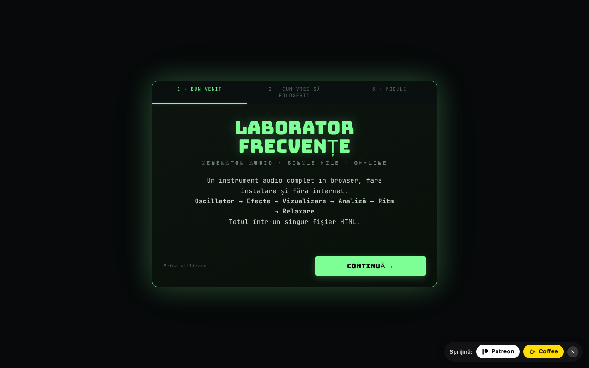

# Frequency Laboratory

Generator audio complet în browser: oscilatoare, binaural, filtre, efecte, pian, analizoare și teste auditive.

**Live:** https://chiuta.github.io/FrequencyLaboratory/

## Ce este

Frequency Laboratory (v4.0 în titlul aplicației) este un laborator audio dintr-un singur fișier HTML, bazat pe Web Audio API. Combină generator de tonuri, sinteză, efecte, sesiuni programabile, instrumente de măsurare cu microfonul și o bază de date de frecvențe (Solfeggio, Schumann, binaurale, acordaje etc.). Aplicația precizează că nu este tratament medical și că categoriile de frecvențe sunt informative.

## Funcții

Funcțiile de mai jos apar ca secțiuni/controale în interfață:

- **Generare:** Osc A și Osc B (sinus, pătrat, triunghi, fierăstrău), mod binaural (Δ binaural), hard sync, ADSR, portamento, filtre (low/high/band-pass, notch, shelf, peaking, comb), sweep, modulare AM/izocronică (ISO 2/6/10/40 Hz), zgomot alb/roz/brun.
- **Sinteză și efecte:** acorduri și arpegiator, sub-oscilator și supersaw, FM, ring, auto-pan, drive/compresor/EQ 5 benzi/gate/chorus/flanger/delay/reverb, filtru de formanți vocale, matrice de modulare LFO, player de progresii de acorduri, step sequencer cu 8 pași, Karplus-Strong, sintetizator granular, looper, acordaje (ET-12, just, pitagoreic, 19-TET, 31-TET, raga, gamelan ș.a.).
- **Pian și MIDI:** claviatură, note scrise (ex. A4), tap tempo, MIDI IN (Web MIDI, doar în browsere care îl suportă), mapări MIDI.
- **Analiză:** osciloscop, spectru FFT, spectrogramă, histogramă, scop de fază (Lissajous), RTA pe 1/3 de octavă, THD estimat, tuner cu microfon, contor SPL cu calibrare, măsurare de cameră (room sweep) cu export CSV.
- **Teste:** identificare canale, polaritate, impuls/chirp, break-in pentru boxe, audiogramă interactivă (export PNG), joc „identifică frecvența”, tinnitus matcher cu mascare notch, tonuri „mosquito”.
- **Sunete ambientale** generate procedural (ploaie, ocean, vânt, foc, pădure).
- **Sesiuni:** etape programabile cu crossfade, șabloane Meditation / Adormire / Solfeggio, sleep timer cu fade, înregistrare WAV pe 16 biți cu pre-roll.
- **Date:** presetări utilizator, favorite, export/import JSON, undo/redo, partajare configurație prin URL, partajare WAV/JSON (Web Share), teme de culoare (Phosphor, Amber, Blue, Mono), Wake Lock, tutorial.
- Interfață în română și engleză.

## Manual de utilizare

1. Deschide pagina și, la nevoie, parcurge tutorialul (`★ TUTORIAL`).
2. Setează frecvența în „Osc A” și forma de undă; ține volumul „master” sub 20% la început (avertisment din aplicație).
3. Apasă `START ▶` (sau Spațiu); `STOP ◼` oprește; `PANIC ✕` (sau `P`) oprește instant.
4. Pentru binaural, pornește „Osc B”, activează „mod binaural” și setează „Δ binaural”; folosește căști.
5. Explorează secțiunile din bara de module (Acorduri, Efecte, Pian, RTA, Audiogram, Ambient, Presets, Database ș.a.).
6. Scurtături: Spațiu start/stop, `P` panic, `R` înregistrare, `↑/↓` frecvență A ±1 Hz, `Shift+↑/↓` ±10 Hz, `1–4` formă de undă, `S` snap la notă, `D` drone, `?` lista de scurtături, `Esc` închide.
7. Înregistrare: `▶ START RECORDING`, apoi `↓ DOWNLOAD WAV`.
8. Presetări: salvează cu nume, apoi `↑ EXPORT JSON` pentru backup și `↓ IMPORT JSON` pentru restaurare (importul se îmbină cu presetările existente).
9. Microfonul (SPL, tuner, RTA pe microfon, room sweep) se activează doar la cerere; browserul cere permisiune.

## Confidențialitate și rețea

- **Stocare locală:** `localStorage`, chei cu prefixul `lab_frecv_` (limbă, temă, presetări, favorite, mapări MIDI, ordinea/starea modulelor, marcaje de onboarding). Ștergerea datelor site-ului șterge presetările; folosește exportul JSON pentru backup.
- **Rețea:** aplicația nu face cereri `fetch` și nu încarcă scripturi sau fonturi externe. Politica CSP din pagină limitează `connect-src` la `'self'`. Linkurile (Patreon, Buy Me a Coffee, alexio.tf, creativecommons.org) sunt hiperlegături deschise doar la click.
- Microfonul este folosit local, doar după acordarea permisiunii; audio-ul nu este trimis nicăieri de aplicație.

## Rulare locală / offline

Descarcă `index.html` și deschide-l în browser; nu necesită internet. MIDI funcționează doar unde există Web MIDI (de ex. Chrome desktop), iar accesul la microfon necesită context sigur (HTTPS sau fișier local, în funcție de browser).

## Licență

CC0 1.0 Universal (domeniu public) — vezi fișierul LICENSE

## Autor

Alexio — Alexandru-Ionuț Chiuță, contact: alexio@trom.tf

## English summary

Frequency Laboratory is a single-file Web Audio toolkit: oscillators and binaural beats, filters and effects, piano/MIDI, sequencer, analyzers (FFT, RTA, phase scope), microphone-based SPL and room measurement, hearing tests, ambient sounds, programmable sessions, WAV recording and a frequency database. Romanian/English UI. State is kept in localStorage (`lab_frecv_` keys); the app makes no network requests (CSP `connect-src 'self'`). It is not a medical device.
